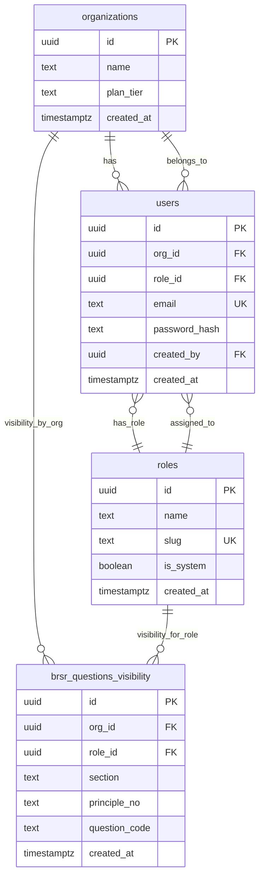
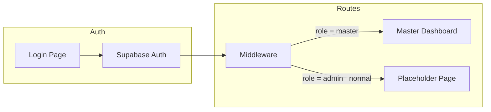

# BRSR Phase 1 — Login, Master Dashboard, Roles & Visibility

## Goal

- **Login page** for all users (Supabase Auth).
- **Master Dashboard**: manage organizations, users, create/assign roles, and configure which roles can see which questions (schema + UI).
- **Normal (and Admin) login** → placeholder page.
- **Database**: credentials and org/role/user data now; schema ready for BRSR questions/answers per client later.
- **Run locally**: Next.js on localhost, Supabase Cloud; productionize in a later phase.

---

## 1. Project setup

- **Scaffold**: Next.js 14+ (App Router), TypeScript, Tailwind CSS, ESLint. Single repo at project root.
- **Supabase**: `@supabase/supabase-js` and `@supabase/ssr` for auth in App Router (server components, middleware, cookies).
- **Env**: `.env.local` with `NEXT_PUBLIC_SUPABASE_URL` and `NEXT_PUBLIC_SUPABASE_ANON_KEY`; use a new Supabase project (cloud) for dev.
- **No Redis**: use Supabase Auth sessions only for Phase 1.

---

## 2. Database schema (Supabase / PostgreSQL)

All tables live in Supabase. Use Supabase SQL editor or migrations for the following.

**Notes:**

- **organizations**: One row per client/tenant. Master can create/list them.
- **roles**: Holds system roles (Master, Admin, Normal) plus custom roles. Seed with `slug` in (`master`, `admin`, `normal`), `is_system = true`. New roles created from Master Dashboard get `is_system = false`.
- **users**: Your app’s user table (not Supabase `auth.users`). Link to Supabase Auth via `auth.users.id` stored as `users.id` (or a dedicated `auth_user_id` column). Columns: `org_id`, `role_id`, `email`, `password_hash` (optional if Supabase Auth holds auth), `created_by`, `created_at`. Master users can have `org_id` NULL or a sentinel “platform” org.
- **brsr_questions_visibility**: Defines “which role can see which question” (and optionally scope by org). Use `section`, `principle_no`, `question_code` so it works before you have a full `brsr_questions` table. When you add `brsr_questions` in Phase 2, you can link by `question_code` or add `question_id` FK. One row per (org?, role, question identifier).

**Auth coupling:** Either (a) use Supabase Auth as source of truth and add a `profiles` table (`id` = `auth.users.id`, `org_id`, `role_id`, `email`), or (b) keep `users` as above and sync from Auth on sign-up/sign-in. Recommended: **profiles** table keyed by `auth.uid()` with `org_id`, `role_id`, and optional `display_name`; RLS and app logic read from `profiles` + `roles` + `organizations`.

**RLS (row-level security):**

- **organizations**: Master sees all; Admin/Normal see only their own org (by `profiles.org_id`).
- **profiles / users**: Master sees all; Admin sees same org; users see only themselves for own profile.
- **roles**: Read for all authenticated; only Master (or backend) can insert/update non-system roles.
- **brsr_questions_visibility**: Master/Admin manage; restrict by `org_id` where applicable.

---

## 3. Auth flow and routing

- **Login page**: Email + password form; call `supabase.auth.signInWithPassword()`. On success, redirect by role (read from `profiles` + `roles`).
- **Middleware**: Protect `/dashboard/`* and `/master/`*. Read JWT (Supabase session), resolve `profile.role` (slug or role_id). Redirect unauthenticated to `/login`. Redirect authenticated:
  - **master** → `/master`
  - **admin** or **normal** → `/dashboard` (placeholder).
- **Sign-out**: `supabase.auth.signOut()` and redirect to `/login`.

Role resolution: in middleware or a small helper, load profile by `auth.getUser()` then fetch `profiles` + `roles` (or use a single RPC that returns `role_slug`) so redirect is accurate.

---

## 4. Master Dashboard (UI structure)

- **Layout**: Sidebar + main content. Sidebar items: **Organizations**, **Users**, **Roles**, **Question visibility** (or “Access / visibility”).
- **Organizations**: List orgs (table/cards), “Add organization” (name, optional plan_tier). Create org in Supabase, then show success.
- **Users**: List users (filter by org if needed). “Add user”: email, password (or “invite” flow with Supabase magic link later), org dropdown, **role dropdown** (from `roles` table). Save to Supabase Auth (if you create users in Auth) + `profiles` (org_id, role_id). Master can see all orgs’ users; filter by org for clarity.
- **Roles**: List roles (name, slug, system vs custom). “Add role”: name, slug (auto from name or editable). Insert into `roles` with `is_system = false`. No delete for system roles; optional soft delete for custom.
- **Question visibility**: Table or form: by **role** (and optionally org), define which **section / principle / question_code** are visible. For Phase 1, use placeholders (e.g. Section A/B/C, Principle 1–9, or “Question set 1”) so the structure is in place; real BRSR questions can be wired in Phase 2. Persist to `brsr_questions_visibility`.

---

## 5. Normal / Admin placeholder

- **Route**: e.g. `/dashboard` (or `/app`). Single page: “Dashboard” heading and “BRSR questionnaire coming in Phase 2” (or similar). No sidebar needed for now, or a minimal one with “Dashboard” and “Log out”.
- **Access**: Any authenticated user with role `admin` or `normal` lands here after login.

---

## 6. Local run and env

- **Supabase**: Create a project at supabase.com; get URL and anon key. No need for Docker; DB is in the cloud.
- **Next.js**: `npm run dev`; app at `http://localhost:3000`.
- **.env.local**:  
`NEXT_PUBLIC_SUPABASE_URL=<project-url>`  
`NEXT_PUBLIC_SUPABASE_ANON_KEY=<anon-key>`
- **First user (Master)**: Create manually in Supabase Auth (or a one-off script) and insert into `profiles` with `org_id` NULL and `role_id` = Master’s role id. Use this account to test Master Dashboard and create orgs/roles/users.

---

## 7. File structure (reference)

- `app/login/page.tsx` — Login form.
- `app/(auth)/layout.tsx` — Optional layout for login (no sidebar).
- `app/(dashboard)/dashboard/page.tsx` — Placeholder for Admin/Normal.
- `app/(master)/master/layout.tsx` — Master layout with sidebar.
- `app/(master)/master/page.tsx` — Master dashboard home (overview or redirect to first section).
- `app/(master)/master/organizations/page.tsx` — List/create orgs.
- `app/(master)/master/users/page.tsx` — List/create users, assign org + role.
- `app/(master)/master/roles/page.tsx` — List/create roles.
- `app/(master)/master/visibility/page.tsx` — Role–question visibility config.
- `app/api/` — Optional API routes (e.g. create user in Auth + profile if you prefer server-side).
- `lib/supabase/client.ts` and `lib/supabase/server.ts` — Supabase clients for browser and server.
- `middleware.ts` — Auth check and role-based redirect.
- `types/database.ts` — Shared types for org, role, profile, visibility.

---

## 8. What stays ready for later

- **BRSR data**: Add `brsr_questions` (and `answers`, `notes`) in Phase 2; link visibility to `question_id` or keep keying by `question_code`/section/principle.
- **Reporting year**: Add `reporting_year` or `period_id` to answers when you introduce them.
- **Production**: Same schema; point Next.js to production Supabase (and optionally a second Supabase project) and deploy to Vercel when you productionize.

---

## 9. Order of implementation (suggested)

1. Next.js + Tailwind + Supabase client/env.
2. DB: create tables (organizations, roles, profiles, brsr_questions_visibility), seed roles, enable RLS.
3. Auth: login page, middleware (protect routes, role-based redirect), sign-out.
4. Create first Master user (manual or script).
5. Master Dashboard: layout and sidebar, then Organizations → Users (with role assign) → Roles (create new) → Visibility (placeholder structure).
6. Placeholder dashboard for Admin/Normal and verify redirect from login.

This gives you a single codebase, localhost UI, Supabase Cloud DB storing credentials and role/org/visibility data, and a clear path to add BRSR questions and production deploy later.