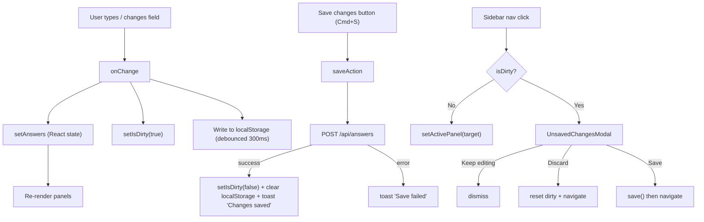

# Explicit Save Model

## Why this likely also fixes the input-clearing bug

The current `scheduleSave` fires 800ms after every keystroke and calls `setSaving(true/false)` inside `save()`. Those state changes re-render `QuestionnaireShell`, which re-renders `LegacyPrincipleRenderer`, which triggers the sync effect against `values` — all while the user is still typing. Removing that cycle eliminates a source of mid-typing re-renders entirely.

## Architecture overview




## Files to change

### 1. `[app/(dashboard)/dashboard/hooks/useAnswers.ts](app/(dashboard)`/dashboard/hooks/useAnswers.ts)

- Remove `scheduleSave`, `saveTimeoutRef`, `SAVE_DEBOUNCE_MS` import
- Add `isDirty: boolean` state (default `false`)
- `onChange`: remove `scheduleSave()` call; add `setIsDirty(true)` and a debounced `localStorage.setItem` (300ms, key `brsr_draft_${orgId}_${reportingYear}`)
- `load`: after setting answers from API, check localStorage for a draft and merge it (`{ ...serverAnswers, ...draftAnswers }`) so unsaved work survives a tab refresh
- `save`: on success call `setIsDirty(false)` and `localStorage.removeItem(draftKey)`; on error re-throw so caller can show error toast
- Remove the two agent debug `fetch("http://127.0.0.1:7762/ingest/...")` blocks
- Export: `{ answers, loading, saving, isDirty, onChange, save }`

### 2. `[app/(dashboard)/dashboard/QuestionnaireShell.tsx](app/(dashboard)`/dashboard/QuestionnaireShell.tsx)

**State additions:**

```typescript
const [pendingPanel, setPendingPanel] = useState<PanelId | null>(null);
const [toast, setToast] = useState<{ message: string; type: 'success' | 'error' } | null>(null);
```

**Navigation guard** — replace direct `setActivePanel(p.id)` in the sidebar with:

```typescript
function handlePanelClick(panelId: PanelId) {
  if (isDirty) { setPendingPanel(panelId); return; }
  setActivePanel(panelId);
}
```

**Save action** (also bound to Cmd+S / Ctrl+S via `useEffect`):

```typescript
async function handleSave() {
  try {
    await save();
    setToast({ message: "Changes saved", type: "success" });
    setTimeout(() => setToast(null), 2000);
  } catch {
    setToast({ message: "Save failed — please try again", type: "error" });
  }
}
```

**Layout change** — add a thin save bar above the `<aside>+content` flex row (still inside `QuestionnaireShell`, below the server-rendered header):

```tsx
<div className="flex items-center justify-end border-b border-[#334155] bg-[#1a202c] px-6 py-2">
  <button onClick={handleSave} className="...">
    {isDirty && <span className="mr-2 h-1.5 w-1.5 rounded-full bg-amber-400 inline-block" />}
    Save changes
  </button>
</div>
```

**Remove** the `{saving && <p className="...">Saving…</p>}` sidebar line.

**Render** `<UnsavedChangesModal>` and `<Toast>` at the bottom of the JSX.

### 3. `[lib/brsr/constants.ts](lib/brsr/constants.ts)`

Remove `SAVE_DEBOUNCE_MS` export (no longer used).

### 4. New: `[components/UnsavedChangesModal.tsx](components/UnsavedChangesModal.tsx)`

Minimal hand-rolled modal following the same fixed-backdrop pattern as the existing `ExportModal`:

- Props: `sectionName: string`, `onKeepEditing`, `onDiscard`, `onSave`
- Three buttons: "Keep editing", "Discard", "Save"
- Title: "Unsaved changes" / Body: "You have unsaved changes in [sectionName]. Would you like to save before leaving?"

### 5. New: `[components/Toast.tsx](components/Toast.tsx)`

- Props: `message: string`, `type: 'success' | 'error'`
- Fixed `bottom-center` position, 2-second auto-fade (CSS transition `opacity 0.4s`)
- Green background for success, red for error

### 6. Cleanup: `[app/(dashboard)/dashboard/panels/LegacyPrincipleRenderer.tsx](app/(dashboard)`/dashboard/panels/LegacyPrincipleRenderer.tsx)

Remove the agent debug `fetch("http://127.0.0.1:7762/ingest/...")` log blocks that were added during the investigation (there are two of them).