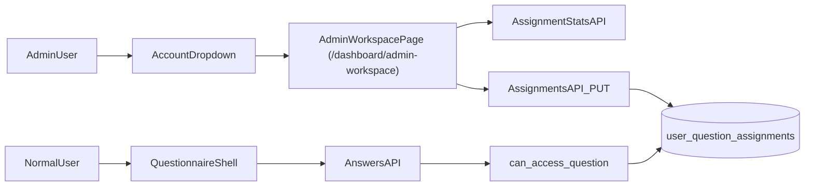

# Admin Control Workspace Plan

## Naming recommendation

Use **`Admin Workspace`** in the account dropdown.

- Better than “Control Panel” because it sounds action-oriented and less technical.
- Alternatives: `Admin Console`, `Team Control Center`.

## Target UX

After admin login, in the dropdown at [AccountDropdown.tsx](/Users/credibl/Desktop/Internal Tooling/BRSR/app/(dashboard)/dashboard/AccountDropdown.tsx):

- Keep `Log out`.
- Add `Admin Workspace` item (only for admins).
- Clicking it opens a new page: `/dashboard/admin-workspace`.

Inside `/dashboard/admin-workspace`:

- **Top section**: total completion statistics for org.
- **Middle section**: per-user completion statistics.
- **Assignment section**:
  - User filter dropdown (all users in org).
  - Section side blocks (default first section selected).
  - Question blocks for selected section.
  - Click block to toggle assignment, tick shows selected.
  - `Confirm Assignment` button writes final selection for selected user.

## Best implementation approach

Keep this as a **single admin page** with 3 tabs/cards, but one backend assignment model.

- Security truth stays in DB (`user_question_assignments`).
- UI is a management layer over that table.
- Non-admin visibility is enforced in API and dashboard filter.

## Data model and enforcement

Create migration: [005_user_question_assignments.sql](/Users/credibl/Desktop/Internal Tooling/BRSR/supabase/migrations/005_user_question_assignments.sql)

- Table `user_question_assignments`:
  - `org_id`, `user_id`, `question_code`, `created_at`
  - unique `(org_id, user_id, question_code)`
- RLS:
  - Admin/master can manage assignments.
  - Users can read only own assignments (optional but useful).

Update `answers` access control:

- Update [004_brsr_answers.sql](/Users/credibl/Desktop/Internal Tooling/BRSR/supabase/migrations/004_brsr_answers.sql) with helper check function (`can_access_question`) and policy predicates so non-admins only read/write assigned question codes.

This prevents bypass from direct API calls.

## API design

Add assignment API: [app/api/assignments/route.ts](/Users/credibl/Desktop/Internal Tooling/BRSR/app/api/assignments/route.ts)

- `GET`:
  - Input: selected `user_id` (admin org implied)
  - Output: assigned question codes + section grouping
- `PUT` (recommended for “finalize” semantics):
  - Input: `user_id`, `question_codes[]`
  - Behavior: replace assignments for that user in one transaction
- Optional `GET ?stats=true` or separate endpoint for statistics

Add stats API (clean separation): [app/api/assignment-stats/route.ts](/Users/credibl/Desktop/Internal Tooling/BRSR/app/api/assignment-stats/route.ts)

- Returns:
  - org-level totals (`assignedQuestions`, `answeredQuestions`, `% completion`)
  - per-user completion list

## Completion metrics (recommended definition)

Use this formula for both org and per-user cards:

- **Assigned count** = number of question codes assigned to user(s)
- **Completed count** = assigned questions with non-empty `answers.value` for selected reporting year
- **Completion %** = `completed / assigned * 100`

This is accurate because users should be measured only against assigned scope.

## Frontend changes

- Update [page.tsx](/Users/credibl/Desktop/Internal Tooling/BRSR/app/(dashboard)/dashboard/page.tsx):
  - fetch role slug
  - pass role to dropdown component
- Update [AccountDropdown.tsx](/Users/credibl/Desktop/Internal Tooling/BRSR/app/(dashboard)/dashboard/AccountDropdown.tsx):
  - if role is `admin`, render `Admin Workspace` menu item
- Add new page: [admin-workspace/page.tsx](/Users/credibl/Desktop/Internal Tooling/BRSR/app/(dashboard)/dashboard/admin-workspace/page.tsx)
  - server-side role guard: admin only
  - render three sections (total stats, per-user stats, assignment builder)
- Add client component for assignment builder:
  - user selector
  - section block rail (default first section)
  - question block grid with toggle/tick states
  - confirm button performs `PUT` replace

## Question block source of truth

Use existing question metadata in [questionConfig.ts](/Users/credibl/Desktop/Internal Tooling/BRSR/lib/brsr/questionConfig.ts):

- Section blocks map from current panel groups and panel IDs.
- Question block ids are question codes from `getQuestionCodesForPanel`.
- Label fallback for phase 1 can be code text (e.g., `gen_1_cin`) until richer labels are introduced.

## Runtime visibility behavior

Dashboard should enforce assigned visibility for non-admin users:

- Filter visible panels and inputs in [QuestionnaireShell.tsx](/Users/credibl/Desktop/Internal Tooling/BRSR/app/(dashboard)/dashboard/QuestionnaireShell.tsx).
- Non-admin with no assignments sees “No questions assigned”.
- Admin remains full visibility.

## Delivery order

1. DB migration for assignments + answer-policy enforcement.
2. Assignment and stats APIs.
3. Dropdown nav + admin workspace route.
4. Stats cards and per-user table.
5. Section/question block assignment UI + confirm replace flow.
6. Dashboard filtering for non-admin users.
7. Verification with admin + normal user scenarios.

## Flow diagram

